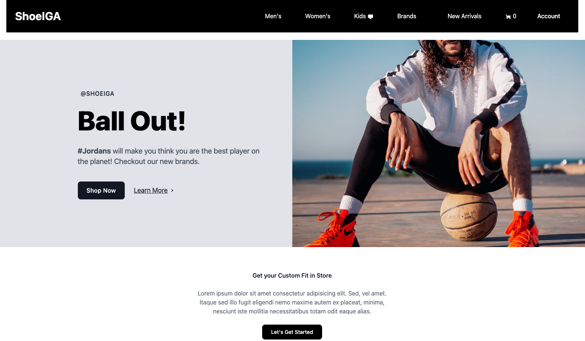

# ShoeIGA 

This is a demo project built using Next 3 (stable) this application is proof of concept. The following technologies were used in the building of this application. 
- [Nuxt](https://nuxt.com)
- [Pinia](https://pinia.vuejs.org)
- [Supabase](https://supabase.com)
- Prisma

## Main 

